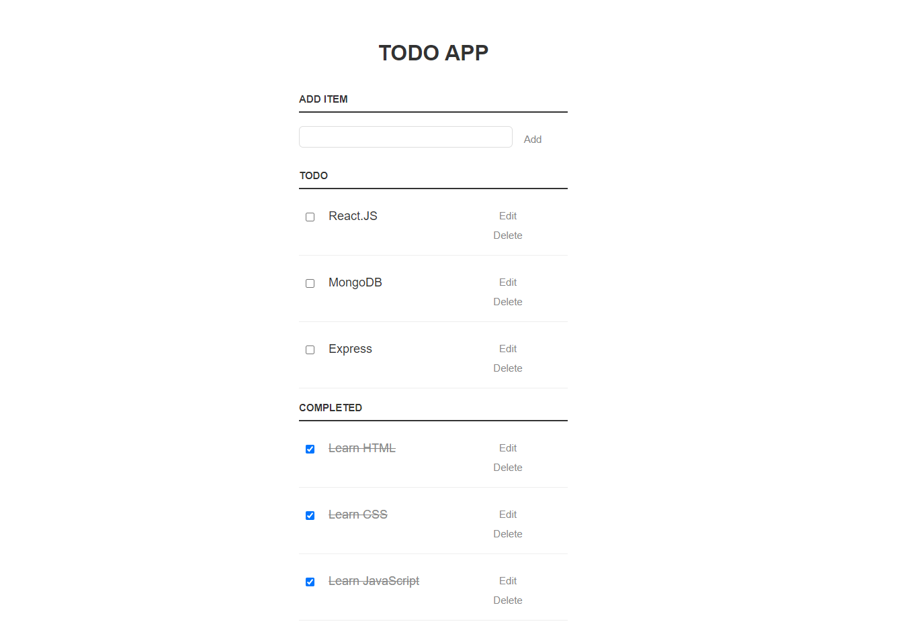

# Todo List Project



This is a simple Todo List project created using HTML, CSS, and JavaScript. It allows you to add and delete tasks from your to-do list. This project is a great starting point for beginners to learn and practice front-end web development.

## Features

- Add tasks to your to-do list.
- Delete tasks from your to-do list.
- Responsive design for various screen sizes.

## Getting Started

Follow these instructions to get a copy of the project up and running on your local machine.

### Prerequisites

- A modern web browser (e.g., Google Chrome, Mozilla Firefox).
- A code editor (e.g., Visual Studio Code, Sublime Text).

### Installation

1. Clone the repository to your local machine:

   ```bash
   git clone https://github.com/your-username/todo-list.git
   ```

2. Navigate to the project directory:

   ```bash
   cd todo-list
   ```

3. Open the `index.html` file in your preferred web browser or code editor.

## Usage

1. Open the project in your web browser by double-clicking the `index.html` file or by running a local server if you prefer.

2. You will see an input field and a "Add Task" button.

3. Type a task into the input field and click "Add Task" to add it to your to-do list.

4. To delete a task, click the trash can icon next to the task you want to remove.

## Contributing

Contributions are welcome! Please follow these steps to contribute to the project:

1. Fork the repository.
2. Create a new branch for your feature or bug fix: `git checkout -b feature/your-feature-name`.
3. Make your changes and commit them: `git commit -m "Add your feature"`.
4. Push your changes to your forked repository: `git push origin feature/your-feature-name`.
5. Create a pull request from your forked repository to this repository.

## License

This project is licensed under the MIT License - see the [LICENSE](LICENSE) file for details.

## Acknowledgments

- This project was created as a learning exercise for front-end web development.
- Inspiration for this project comes from various online tutorials and resources.

## Contact

If you have any questions or feedback, feel free to contact me at your-email@example.com.

Happy coding!
